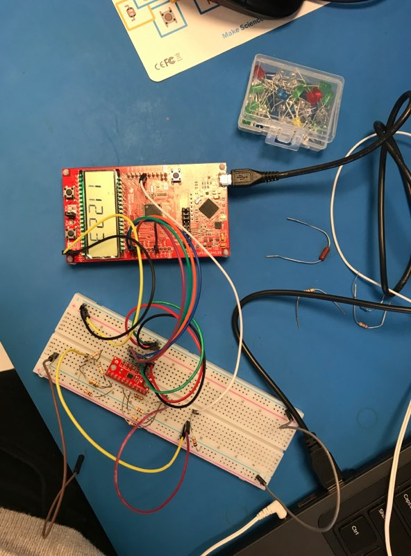
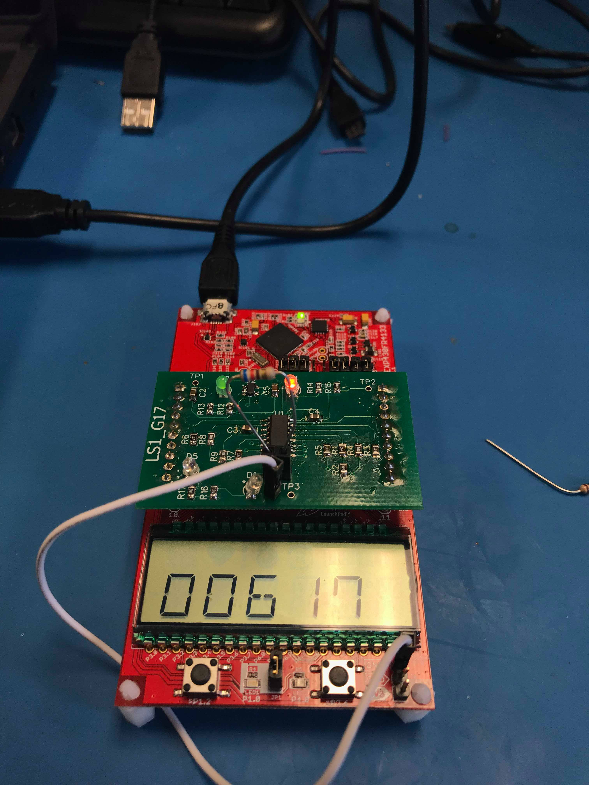

# msp430-resistance-sensor
Resistance Sensor Embedded System built for ECE 298 by Andy Jin and Kelly Tang

### Problem Statement
Resistance can be measured a variety of different ways, but the setup is often tedious without the proper equipment and there is a lot of room for error. Design a resistance sensing device that utilizes analog voltage sensing and has notable features such as auto-ranging and user-friendly display to solve this problem 

### Design
Our design for the resistance sensor is bascially that of a simple voltage divider. Given a constant input voltage, and a known reference resistor, we can measure the voltage drop across the unknown resistance and solve for the unknown resistance. To give it the auto-ranging feature, we need a variety of reference resistors which will switch automatically based on input resistance. 

### Prototype
Shown below is the initial prototype working with a 8-to-1 mux breakout board and MSP430 discovery board.

  

### PCB
Once we finalized the design, a PCB was manufactured and we were able to stress test our product to ensure it met specifications and requirements. We can see in the image that given a 620 Ohm resistor, our output was 617 Ohm which gave us an error of < 1% which was well below our expected at ~5% (of course we have to note that the resistor itself has internal error). 

  

### Remarks
We had some hardware issues that we would like to resolve if there were to be a rev 2. Firstly, we found our accuracy dropped considerable beyond 10 kOhm which is due to the fact that the low-impedence ADC input of the MSP430 adds another resistor in parallel with the input resistor which would skew the voltage reading across our unknown resistor. We would like to add some sort of buffer between the resistor circuit and the ADC input pin. Secondly, we had to manually short one of a pins which was misconnected (as seen in the images with the white jumper cable).
